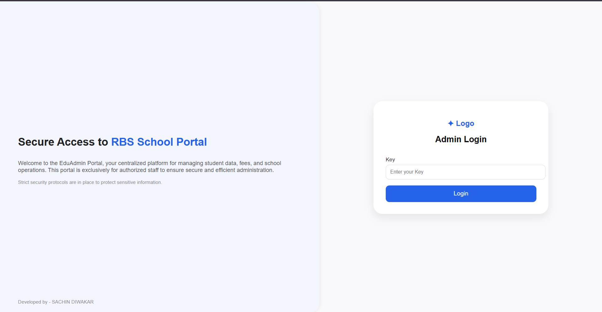
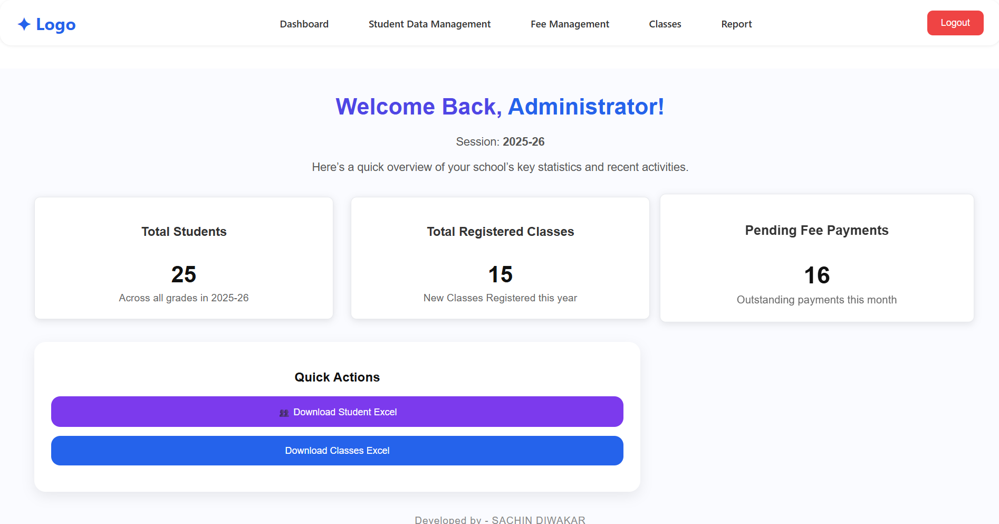
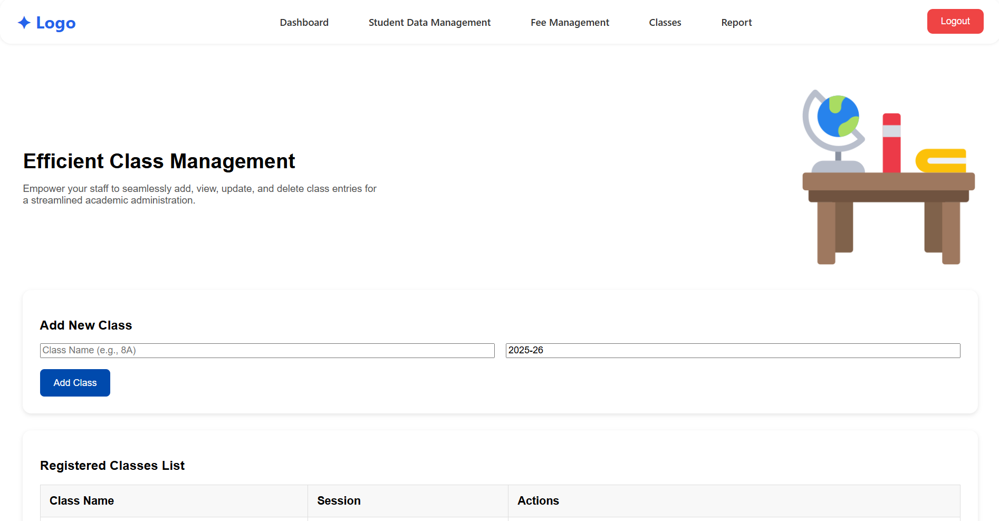

# 🎓 Acadify — School Management System

> A full-stack SaaS platform built to modernize school administration through automation, analytics, and secure data management.


---

## 📌 Overview

Acadify is a centralized school management platform developed to replace manual administrative workflows with a fast, secure, and scalable digital system.

Designed for institutions with **500+ students**, the platform simplifies:

- Student data management  
- Fee tracking & collection reporting  
- Class/session administration  
- Bulk academic result generation  
- Secure admin access  
- Operational analytics dashboards  

This project demonstrates real-world full-stack engineering, database optimization, and product-oriented thinking.

---

## 🚀 Key Impact

✅ Digitized manual school workflows for a 500+ student institution  
✅ Reduced administrative result processing time by **~80%** using Excel automation  
✅ Saved **15+ staff hours/week** through workflow automation  
✅ Improved dashboard query speed by **~60%** using MySQL indexing  
✅ Centralized data into one secure admin portal

---

## 🛠 Tech Stack

| Layer | Technology |
|------|------------|
| Frontend | React.js |
| Backend | Node.js + Express.js |
| Database | MySQL |
| Authentication | JWT |
| Integrations | WhatsApp API |
| File Processing | Excel Import / Export |

---

## ✨ Core Features

### 🔐 Secure Admin Authentication
- JWT-based protected login system
- Session validation
- Restricted admin-only access

### 👨‍🎓 Student Data Management
- Add / update / delete student records
- Searchable student database
- Class-wise organization

### 💳 Fee Management
- Monthly fee tracking
- Paid / unpaid status
- Collection analytics
- Student fee profile history

### 🏫 Class Management
- Create and manage academic classes
- Session-based organization

### 📊 Reports & Analytics
- Revenue summaries
- Paid vs unpaid distribution
- Visual dashboards

### 📁 Excel Automation
- Bulk import/export records
- Result sheet processing

### 📲 Communication Layer
- WhatsApp notification integration

---

## 📸 Screenshots

### Login Portal


### Admin Dashboard


### Fee Analytics Report


### Class Management


---

## ⚡ Performance Engineering

Acadify was optimized for real-world usage through:

- Composite indexing on high-frequency MySQL queries  
- Reduced dashboard latency by ~60%  
- Efficient API structuring  
- Reusable React component architecture

---

## 📂 Project Structure

```text
Acadify/
├── Frontend/      # React client
├── Backend/       # Node.js API server
├── screenshots/   # README assets
└── README.md